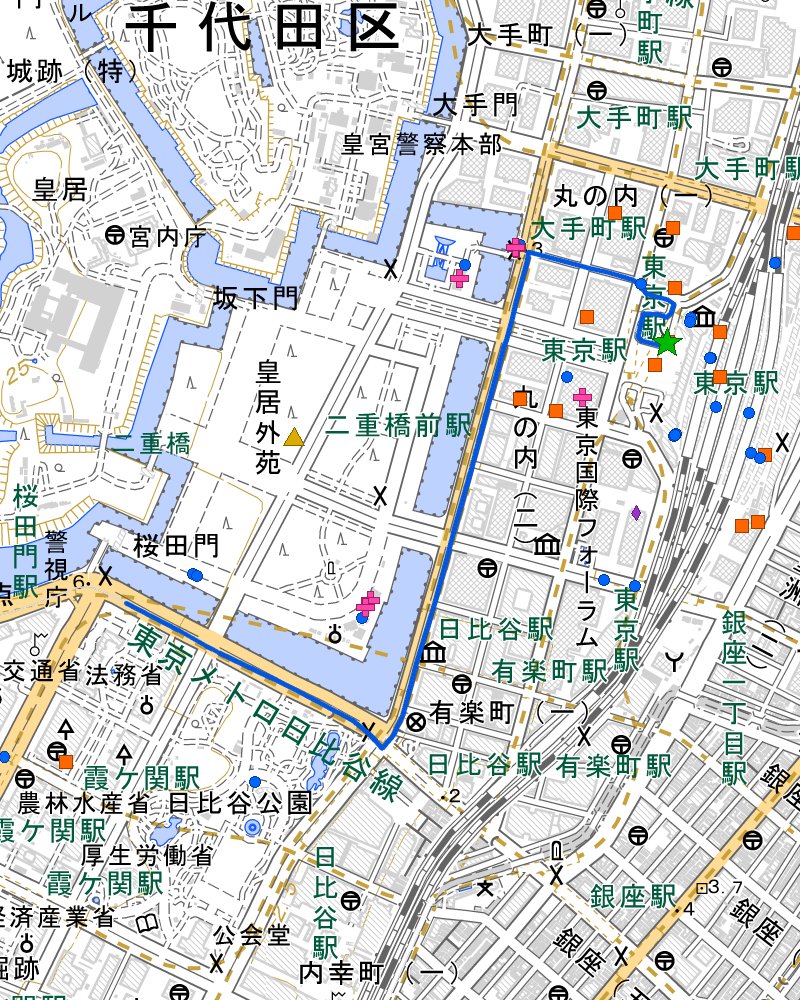

# skill-kitaku-navi

災害時の徒歩帰宅ルートを自動生成し、防災情報付きPDFマニュアルを出力する **Claude Code スキル**です。

> AGI Lab AI Agent ハッカソン提出作品

## コンセプト

大規模災害時、公共交通機関が止まり、スマホの充電も切れた状況で、**紙1枚で自宅まで歩いて帰る**ためのマニュアルを事前に作成します。

- 「最短ルート」ではなく**「帰宅支援情報付きルート」**
- ルート沿いの**避難場所・コンビニ・トイレ・AED・病院**を自動収集
- **通り名付きのターンバイターン案内**で、地図が読めなくても歩ける
- すべて**APIキー不要**のオープンデータを使用

## 出力例

### 区間地図（淡色地図 + 施設マーカー）



| マーカー | 対象 |
|----------|------|
| 緑★ | 出発地 |
| 赤★ | 目的地 |
| 黄▲ | 避難場所 |
| 橙■ | コンビニ（帰宅支援ステーション） |
| 青● | 公衆トイレ |
| 桃＋ | AED |
| 紫◆ | 病院・クリニック |

### PDFの構成

1. **表紙** — 出発地・目的地・総距離・所要時間・施設件数サマリー
2. **帰宅前の準備** — 必要水分量の自動計算・持ち物チェックリスト・地図凡例
3. **区間地図 + ナビゲーション** — 2km区間ごとの拡大地図と曲がり角の指示
4. **避難場所一覧** — 対応災害種別（地震・洪水・津波等）付き
5. **緊急連絡先** — 110/119・災害用伝言ダイヤル(171)の使い方・徒歩帰宅の心得
6. **出典・ライセンス**

## 使い方

### 前提条件

- [Claude Code](https://claude.ai/code) がインストール済みであること
- Python 3.10+
- ネットワーク接続（API呼び出しに必要）

### インストール

```bash
# Claude Code にスキルをインストール
claude skill install kankan3023/skill-kitaku-navi

# または手動でクローン
git clone https://github.com/kankan3023/skill-kitaku-navi.git
cd skill-kitaku-navi
pip install -r plugins/kitaku-route/requirements.txt
```

### 実行

Claude Code で以下のように話しかけるだけ：

```
東京駅から新宿駅まで帰宅ルートを作って
```

または：

```
/kitaku-route 東京駅 新宿駅
```

スキルが自動的に以下を実行します：

1. 住所→座標変換（国土地理院API）
2. 徒歩ルート計算（OSRM）
3. ルート沿いの施設検索（Overpass API）
4. 東京都オープンデータから避難場所取得
5. 区間分割地図の生成（国土地理院淡色タイル）
6. PDF出力

## アーキテクチャ

```
plugins/kitaku-route/
├── skills/kitaku-route/
│   └── SKILL.md          # スキル定義（Claude Codeへの指示書）
├── scripts/
│   ├── geocode.py         # ジオコーディング（国土地理院 + Nominatim）
│   ├── route.py           # OSRM徒歩ルート + ターンバイターン案内
│   ├── facilities.py      # Overpass APIで施設検索
│   ├── shelters.py        # 東京都オープンデータ避難場所
│   ├── map_image.py       # 区間分割地図生成（staticmap + Pillow）
│   └── generate_pdf.py    # PDF生成（fpdf2）
├── fonts/
│   └── NotoSansJP-Variable.ttf
└── requirements.txt       # staticmap, fpdf2
```

### エージェント的な振る舞い

SKILL.md がClaude Codeに対する「手順書」として機能し、各Pythonスクリプトを自律的に呼び出してPDFを生成します。ユーザーは出発地と目的地を伝えるだけで、残りはすべてエージェントが処理します。

## 使用データソース（すべてAPIキー不要）

| サービス | 用途 |
|----------|------|
| [国土地理院 API](https://msearch.gsi.go.jp/) | ジオコーディング（住所→座標） |
| [国土地理院 淡色地図タイル](https://maps.gsi.go.jp/development/ichiran.html) | 地図背景 |
| [OSRM](https://project-osrm.org/) | 徒歩ルート計算 |
| [Overpass API](https://overpass-api.de/) | OSM施設検索（コンビニ・トイレ・AED等） |
| [東京都オープンデータ](https://portal.data.metro.tokyo.lg.jp/) | 避難場所一覧 |
| [Nominatim](https://nominatim.openstreetmap.org/) | ジオコーディング（フォールバック） |

## ライセンス

MIT

### データの出典・ライセンス（PDF内に自動記載）

- 地図データ: © OpenStreetMap contributors (ODbL)
- 地図タイル: 国土地理院
- 避難場所データ: 東京都オープンデータ (CC BY 4.0)
- ルート計算: OSRM (Open Source Routing Machine)
- 施設データ: OpenStreetMap Overpass API
